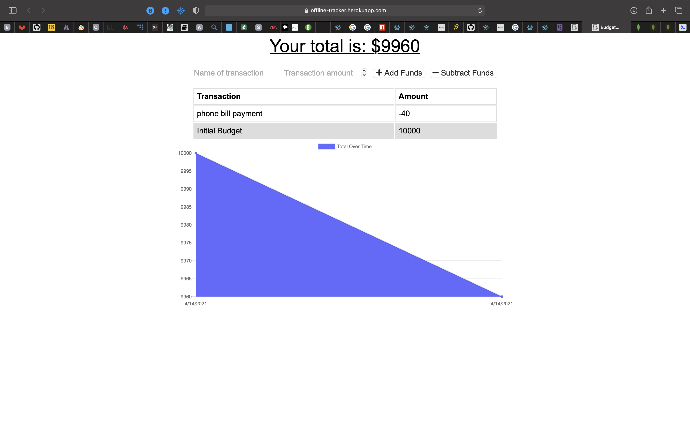

## online-offline-budget-tracker

# Description

This application was created to display offline capability.

---
# Preview

![Link] (https://offline-tracker.herokuapp.com)

---

## Table of Contents

[Description of Application](#description)

[How to Install](#installation)

[How to Use](#usage)

[License Coverage](#license)

[How to Contribute](#contributing)

[Contact Information](#questions)
    
---

# Installation

To install just fork over the repository and run npm install in your IDE of choice. Run a node server.js in the terminal.

---

 # Usage

Once the application is up, put the name of the type of transaction that you are going to make and the amount of the transaction in the field next to it. Click the add or subtract button to add or deduct from your total budget amount.

---
# License

---
# Contributing

Contact via email or github

---
# Questions

jamesgault1488@gmail.com

JJG1488

Contact via email or github

